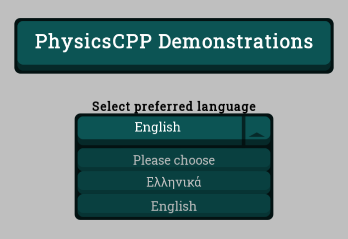
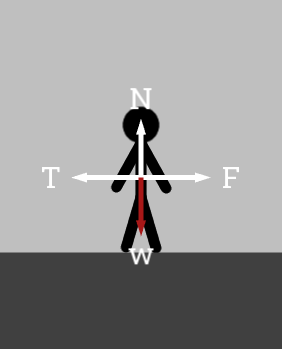

# PhysicsCPP: modular physics demonstration library (+software) written in C++ 

This project was presented at the '13th Panhellenic/International Conference "ICT in Education"'.




## External dependencies

- SFML 2.5.1 for rendering graphics (packaged as git submodule)

## Requirements

- System that supports legacy OpenGL (graphics only).
- CMake 3.16 or greater.
- GNU Make/Ninja.
- A C++ compiler such as clang or g++ with C++17 support (only standard C++ features in use).
- Git for cloning recursively (optional, as *.zip downloads are not encouraged).
- (All of the mentioned tools must be in the PATH in order for the instructions to work properly).

## Build instructions for shell/powershell

```sh
git clone --recursive https://github.com/undefinedpp/physics.git
cd physics && mkdir build && cd build && cmake -G [name of generator] ..
```

For CMake generator examples, see [Link to the CMake manual](https://cmake.org/cmake/help/latest/manual/cmake-generators.7.html)

## Pros for users

- Active support (through Issues)
- Feedback is always taken into account
- Use of the GPL v3.0

## Pros for developers

- Modular and extensible
- Simple, easy to understand UI library
- Easy to code demonstrations in
- Well documented and organized source control
- Open to contributions (through Pull Requests)
- Actively maintained

## UI library elements

- Label
- Button
- Dropdown
- Image
- Labeled Image
- Layout (Horizontal, Vertical, Grid)
- Slider
- Textured (Button and Dropdown)

## Personal coding environment

See [my GitHub profile](https://github.com/fosspointer)

## Future plans

- Backwards compatibility through C++11 (dynamic implementation for versions C++11-23).
- Better cross platform implementation (such as Android support for mobile devices).
- Stop the "problematic" dependency on SFML (as the library is not totally used as intended); use OpenGL and Vulcan instead. 
- Expand demonstration capabilites of the software.
- Optimize for ease-of-use of client-implementation, simplifying the proccess further.
- Improve accessibility (mouse, keyboard, touchscreen, etc...).
- Make the client able to be used standalone (without any programming requirements) (this includes incorporating a client-side tool to build presentations).
- Expand on the use cases of the software and library.
- Implement tests and maximize performance and CPU + Memory efficiency.
- Adjust to fit my personal coding standard.
- Support a scripting language for presentations.
- Improve the consistency of the documentation.
- Translate the client for more language (only English and Greek are currently supported).
- Move all implementations into .cpp files (getting rid of header implementations wherever possible).
- Adjust to the FossPointer standard (included as submodule, [link to the GitHub Repository](https://github.com/fosspointer/code_standard)).

